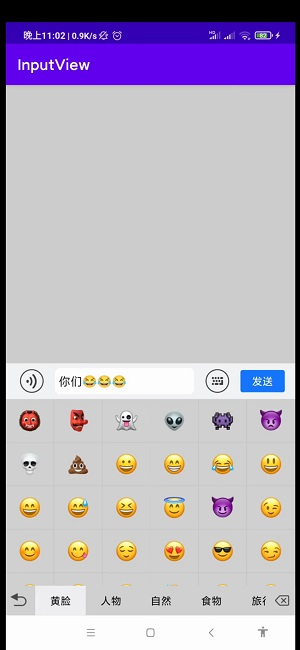
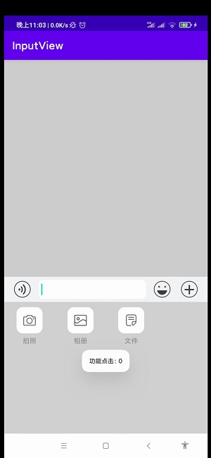
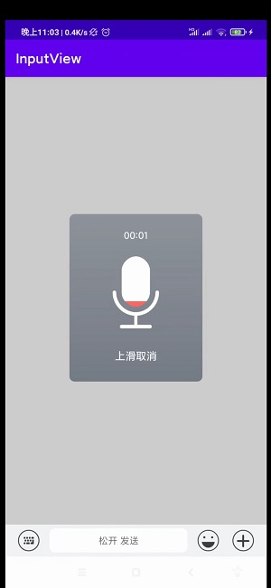
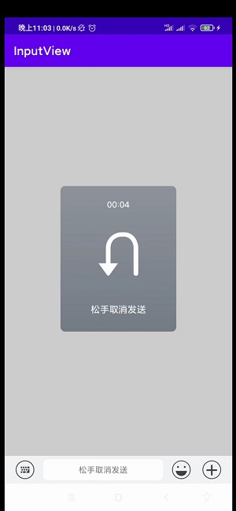

custom chat input component —— InputView
===

```kotlin
allprojects {
		repositories {
			...
			maven { url 'https://jitpack.io' }
		}
	}
```

```kotlin
dependencies {
	        implementation 'com.github.mtjsoft:InputView:1.1.0'
	}
```

### 1、xml add InputView

```kotlin
<?xml version="1.0" encoding="utf-8"?>
<LinearLayout xmlns:android="http://schemas.android.com/apk/res/android"
    xmlns:app="http://schemas.android.com/apk/res-auto"
    xmlns:tools="http://schemas.android.com/tools"
    android:layout_width="match_parent"
    android:layout_height="match_parent"
    android:orientation="vertical"
    tools:context=".MainActivity">

    <androidx.recyclerview.widget.RecyclerView
        android:id="@+id/recyclerView"
        android:layout_width="match_parent"
        android:layout_height="0dp"
        android:layout_weight="1" />

    <cn.mtjsoft.inputview.InputView
        android:id="@+id/bottom_input"
        android:layout_width="match_parent"
        android:layout_height="wrap_content"
        app:audioIconResId="@mipmap/ic_read_voice"
        app:emojiBackIconResId="@mipmap/revert"
        app:emojiColumnNumber="8"
        app:emojiDeleteIconResId="@mipmap/delete_icon"
        app:emojiIconResId="@mipmap/ic_emjio"
        app:emojiTypeListBgColor="@color/design_default_color_error"
        app:emojiTypeSelectBgColor="@color/purple_200"
        app:funCationColumnNumber="4"
        app:funCationIconResId="@mipmap/ic_add_image"
        app:inputViewBgColor="@color/input_bg"
        app:keyboardIconResId="@mipmap/icon_keyboard"
        app:panelBackgroundColor="@color/teal_200"
        app:sendBtnBackgroundResId="@drawable/send_btn_bg"
        app:voiceMaxTime="20"
        app:voiceMinTime="3" />

</LinearLayout>
```
### 2、activity use demo

```kotlin
class MainActivity : AppCompatActivity() {
    override fun onCreate(savedInstanceState: Bundle?) {
        super.onCreate(savedInstanceState)
        setContentView(R.layout.activity_main)

        val inputView = findViewById<InputView>(R.id.bottom_inputview)

        // 功能面板示例数据
        val functionData = mutableListOf<FunctionEntity>()
        val ids = listOf(
            cn.mtjsoft.inputview.R.mipmap.btn_skb_record,
            cn.mtjsoft.inputview.R.mipmap.btn_skb_picture,
            cn.mtjsoft.inputview.R.mipmap.btn_skb_file
        )
        val names = listOf("拍照", "相册", "文件")
        ids.mapIndexed { index, i ->
            functionData.add(FunctionEntity(i, names[index]))
        }

        inputView
        // 设置功能面板数据
        .setFuncationData(functionData)
        // 设置功能面板点击回调
        .setFuncationClickListener(object : AdapterItemClickListener {
            override fun onItemClick(view: View, position: Int) {
                Toast.makeText(baseContext, "功能点击：${functionData[position].name}", Toast.LENGTH_SHORT).show()
            }
        })
        // 设置发送按钮点击回调
        .setSendClickListener(object : SendClickListener {
            override fun onSendClick(view: View, content: String) {
                Toast.makeText(baseContext, "发送$content", Toast.LENGTH_SHORT).show()
            }
        })
        // 设置录音完成回调
        .setVoiceOverListener(object : VoiceOverListener {
            // 没有录音权限回调，在这里申请权限
            override fun noPermission(permission: String) {
                if (Build.VERSION.SDK_INT >= Build.VERSION_CODES.M) {
                    requestPermissions(
                        arrayOf(permission),
                        0
                    )
                }
            }

            override fun onOver(fileName: String, filePath: String, duration: Int) {
                Toast.makeText(baseContext, "录音时长：$duration 秒，$filePath", Toast.LENGTH_SHORT)
                    .show()
                Log.e("mtj", "地址：$filePath \n时长：$duration 秒")
                // 播放PCM格式音频
                PCMAudioPlayer.instance.startPlay(filePath)
            }
        })
    }

    override fun onPause() {
        super.onPause()
        // 释放音频播放
        PCMAudioPlayer.instance.release()
    }
}
```
### 3、示例展示





### 4、版本

V1.1.0  新增自定义属性
--------------------------

1.1.0 属性  | 属性说明
------------- | -------------
audioIconResId  | 设置语音图标
emojiBackIconResId  | 设置表情也的返回图标
emojiColumnNumber  | 设置表情显示的列数 默认8
emojiDeleteIconResId  | 设置表情页的删除图标
emojiIconResId  | 设置表情图标
emojiTypeListBgColor  | 设置表情类型列表的背景色
emojiTypeSelectBgColor  | 设置表情类型选中的颜色
funCationColumnNumber  | 设置功能面板的列数 默认4
funCationIconResId  | 设置功能面板的图标
panelBackgroundColor  | 设置面板的背景色
inputViewBgColor  | 设置整个输入框的背景色
keyboardIconResId  | 设置显示键盘图标
sendBtnBackgroundResId  | 设置发送按钮背景色
voiceMaxTime  | 设置录音最大时长 单位秒 默认60秒
voiceMinTime  | 设置录音最小时长 单位秒 默认1秒

